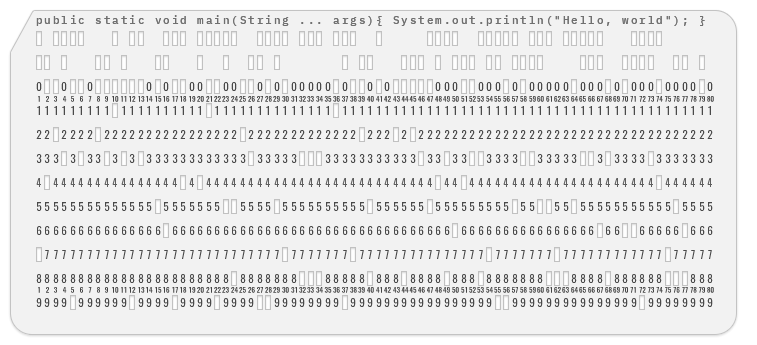

# KeypunchBot

  

A Telegram bot that generates images of punched cards or punched tape with
user-defined text encoded. It can be accessed via the following link:
[t.me/keypunch_bot](https://t.me/keypunch_bot).

KeypunchBot supports multiple encodings listed below. To see all characters
supported by currently selected encoding use `/characters` command.

| Encoding name   | Command to activate | Storage medium         |
|-----------------|---------------------|------------------------|
| ASCII           | `/ascii`            | 80-column punched card |
| EBCDIC          | `/ebcdic`           | 80-column punched card |
| EBCDIC-880      | `/ebcdic880`        | 80-column punched card |
| ITA-2 (CCITT-2) | `/ita2`             | 5-bit punched tape     |
| MTK-2           | `/mtk2`             | 5-bit punched tape     |

KeypunchBot can generate images and send them as a photo or a document as
PNG (`\png`) or JPEG (`\jpeg`) files. It can also generate text files
(`\text`).

To see the list of all supported commands send `\help` command.

## Generated output examples

### Punched card (EBCDIC encoding)

### Punched tape (ITA-2 encoding)

## Dependencies

The KeypunchBot uses the following open-source libraries:

* [click](https://click.palletsprojects.com/)
* [Pillow](http://python-pillow.org/)
* [pymongo](https://api.mongodb.com/python/current/)
* [python-telegram-bot](https://github.com/python-telegram-bot/python-telegram-bot)
* [PyYAML](https://github.com/yaml)
* [Tornado](https://www.tornadoweb.org/en/stable/)

The following tools and libraries were used during the project's development:

* [pytest](https://docs.pytest.org/en/latest/)
* [pylint](https://www.pylint.org/)
* [mypy](http://mypy-lang.org/)
* [mongomock](https://github.com/mongomock/mongomock)
